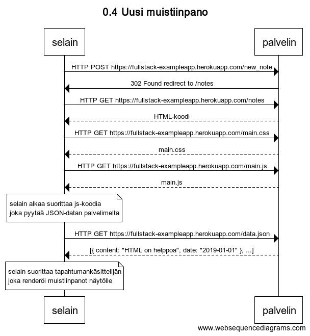
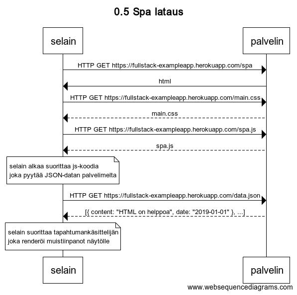
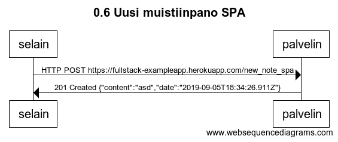

Osa0

[websequencediagrams](https://www.websequencediagrams.com/)

```
title 0.4 Uusi muistiinpano

selain->palvelin: HTTP POST https://fullstack-exampleapp.herokuapp.com/new_note
palvelin->selain: 302 Found redirect to /notes
selain->palvelin: HTTP GET https://fullstack-exampleapp.herokuapp.com/notes
palvelin-->selain: HTML-koodi
selain->palvelin: HTTP GET https://fullstack-exampleapp.herokuapp.com/main.css
palvelin-->selain: main.css
selain->palvelin: HTTP GET https://fullstack-exampleapp.herokuapp.com/main.js
palvelin-->selain: main.js
note over selain:
selain alkaa suorittaa js-koodia
joka pyytää JSON-datan palvelimelta
end note

selain->palvelin: HTTP GET https://fullstack-exampleapp.herokuapp.com/data.json
palvelin-->selain: [{ content: "HTML on helppoa", date: "2019-01-01" }, ...]

note over selain:
selain suorittaa tapahtumankäsittelijän
joka renderöi muistiinpanot näytölle
end note
```



```
title 0.5 Spa lataus

selain->palvelin: HTTP GET https://fullstack-exampleapp.herokuapp.com/spa
palvelin->selain: html
selain->palvelin: HTTP GET https://fullstack-exampleapp.herokuapp.com/main.css
palvelin-->selain: main.css
selain->palvelin: HTTP GET https://fullstack-exampleapp.herokuapp.com/spa.js
palvelin-->selain: spa.js
note over selain:
selain alkaa suorittaa js-koodia
joka pyytää JSON-datan palvelimelta
end note

selain->palvelin: HTTP GET https://fullstack-exampleapp.herokuapp.com/data.json
palvelin-->selain: [{ content: "HTML on helppoa", date: "2019-01-01" }, ...]

note over selain:
selain suorittaa tapahtumankäsittelijän
joka renderöi muistiinpanot näytölle
end note
```



```
title 0.6 Uusi muistiinpano SPA

selain->palvelin: HTTP POST https://fullstack-exampleapp.herokuapp.com/new_note_spa
palvelin->selain: 201 Created {"content":"asd","date":"2019-09-05T18:34:26.911Z"}
```


